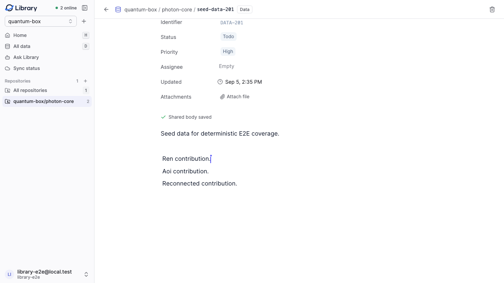

# Data editor の Photon Live 連携

[PLT-4204](https://linear.app/issue/PLT-4204) の Library adapter。
Photon 自体の設計は [upstream](https://github.com/quantum-box/photon) を参照する。
Library の authority / ACL / checkpoint 境界は
[ADR-0006](../../../docs/specs/decisions/ADR-0006-library-photon-bounded-contexts.md) と
[ADR-0009](../../../docs/specs/decisions/ADR-0009-retire-photon-engine-server.md) に従う。

## 対象

data editor の RichText / Markdown 本文を BlockNote の Y.XmlFragment に接続する。
参加者のカーソルは Awareness で共有する。HTML artifact のソース、タイトル、
通常 Property は従来の編集経路を使う。

Live の状態は共同作業中の本文であり、Library への保存完了とは区別する。
保存は本文 Property だけの CAS checkpoint とし、他の Property やタイトルを
古い値に戻さない。競合は保存成功にせず、編集内容を保持して表示する。
通常 Property の更新で record version だけが進んだ場合は、本文が直前の保存内容と
同じことを再確認してから次の checkpoint を送る。本文自体が外部で変更された場合は
自動的に上書きしない。

## 認可とルーム

ブラウザは利用者の認証情報を付けて Library Live adapter にセッションを要求する。
adapter は Library API で対象データの存在、Property、書き込み権限を確認する。
ルームは API が返す tenant / database / data / property の識別子から決める。
汎用の `/ws?room=` と data editor の private room は別の binding に置く。

WebSocket URL には短命の ticket のみを入れる。再接続時にも認可を受け直す。
初回に canonical 本文から作る Yjs seed はサーバが一つだけ受け付ける。
後から入ったクライアントは自分の seed を混ぜず、Photon の snapshot を使う。

## 有効化前の条件

この変更だけで本番の Live を有効にしない。まず
[Record patch decision UoW の導入条件](../../../docs/specs/operations/record-patch-decision-uow.md)
に従って PropertyValue backfill / parity と dual-write の準備を完了させる。
`legacy_only` のまま CAS mutation port を公開しない。

条件がそろった環境で次を設定する。

| 場所 | 設定 |
|---|---|
| Library API | `LIBRARY_PHOTON_LIVE_ENABLED=true` と、検証済みの dual-write `PROPERTY_VALUE_STORAGE_MODE` |
| Worker | `PHOTON_LIVE_ENABLED=true`、`PHOTON_LIVE_API_BASE_URL`、`PHOTON_LIVE_ALLOWED_ORIGINS` |
| Client build | `VITE_LIBRARY_DATA_LIVE_URL` に Worker の HTTP(S) origin |

Worker の Live用 Durable Object binding は `PHOTON_LIVE_ROOMS` と
`PHOTON_LIVE_TICKETS`。許可Originは実際に使うWeb / Tauriシェルに合わせる。
利用者Bearerを固定のサービス権限に置き換えない。

## PR301 の隔離Preview

`wrangler.preview.jsonc` は `library-client-live-pr301` 専用で、本番とは別の
Durable Object namespace を作る。既定では無効。公開時に CLI の `--var` で
`PHOTON_LIVE_ENABLED:true`、`PHOTON_LIVE_API_BASE_URL:<PR専用API origin>`、
`PHOTON_CLOUD_ENGINE_BASE_URL:<同じAPI origin>`、
`PHOTON_LIVE_ALLOWED_ORIGINS:<実際のPages Preview origin>` を明示する。
先に `wrangler deploy --config wrangler.preview.jsonc --dry-run` を確認する。

APIの `LIBRARY_PHOTON_LIVE_PREVIEW_REQUIRE_EMPTY=true` は、候補Lambdaの
migration gateでPR専用DB名を検証し、migration後の `data` が0件であることを
DB側のCOUNTで確認する。既存レコードがある環境では候補の昇格を拒否する。
この空DBチェックは既存データのbackfill/parity検証を代替しない。

APIのLive設定・dual-write設定は、Tachyonの
`--target preview --branch feature/plt-4204-data-editor-photon-live` に限定する。
クライアントはPreview専用の `npm run build:preview` を使う。branch限定の
`LIBRARY_PREVIEW_API_BASE_URL` / `LIBRARY_PREVIEW_SYNC_WS_URL` /
`LIBRARY_PREVIEW_DATA_LIVE_URL` を最後にVite設定へ適用し、manifestの本番URLによる
上書きを防ぐ。3つをまとめて指定し、本番APIや異なるLive/Sync hostは拒否する。
未設定のPRではLiveを無効にする。
初回の空DB確認からdual-writeを維持し、その状態で作成した検証データを
継続利用する場合は、初期化用の空DBチェックを解除する。PR301では初回の候補昇格後、
全検証データを通常のdual-write作成経路で追加し、Live保存を実確認してから解除した。
既存データを持つ別環境のbackfill/parityを省略する用途には使わない。

## ローカル検証

`apps/client` で `npm run test:e2e:live` を実行する。
`playwright.live.config.ts` が Library API fixture（50063）、実際の Photon Worker
（8788）、client（5187）を起動する。`wrangler.live-test.jsonc` はローカル専用で、
公開用の設定ではない。各テストのAPI fixtureは新しいdatabase IDを発行するため、
過去のDurable Object状態を誤って再利用しない。

このテストは実際のLibrary DB、権限サービス、CASのDBトランザクションを
検証するものではない。それらはRust側と実環境のゲートで確認する。

検証では次の結果を分けて記録する。

- エディタと接続 adapter の unit tests / 型チェック
- Photon Durable Object を使ったローカルの2ブラウザ検証（Library API は fixture）
- 実際の Library API / DB に対する認可・CAS検証
- 本番設定・デプロイ後の認証済みブラウザ検証

DB migration / backfill、Worker の公開、本番設定変更はローカル検証の成功から
推測しない。

## 公開Previewと検証結果（2026-09-05）

- 画面: https://pr301--library-client.txcloud.app
- API: https://pr301--library-api.txcloud.app
- Worker: `library-client-live-pr301`（本番と別のDurable Object）
- 検証データ: [共同編集テスト](https://pr301--library-client.txcloud.app/test-org/photon-live-check/data/data_01m1rbpv6tt0efg6zhfyhk0sx4)

初回の空DB確認付きAPI候補を昇格後、test-orgをPreviewへ取り込み、非公開の
`photon-live-check` リポジトリを作成。初期データ2件と共同編集テスト1件を表示した。
配信JavaScriptのAPI / Live / Sync URL、許可OriginのCORS 204、未認証401、
許可外Origin403を確認済み。同一アカウントの2タブで本文の双方向反映と
「本文を共同保存しました」表示、片方を閉じて再読み込み後の本文保持を確認し、
利用者からも共同編集できることを確認いただいた。

初回実装のCIは全項目成功。client 489件、Worker 14件、実Photon Worker + fixture
APIのLive E2E 5件、既存E2E desktop 22件 / mobile 3件が成功した。
Preview migration gateの局所テスト8件も成功。
レビュー修正後の最終検証はPR #301の検証欄を参照する。

別アカウント間と実macOS日本語IME候補ウィンドウの手動検証は未実施。
本番のLiveは無効で、既存本番データのbackfill/parityは別途必要。

