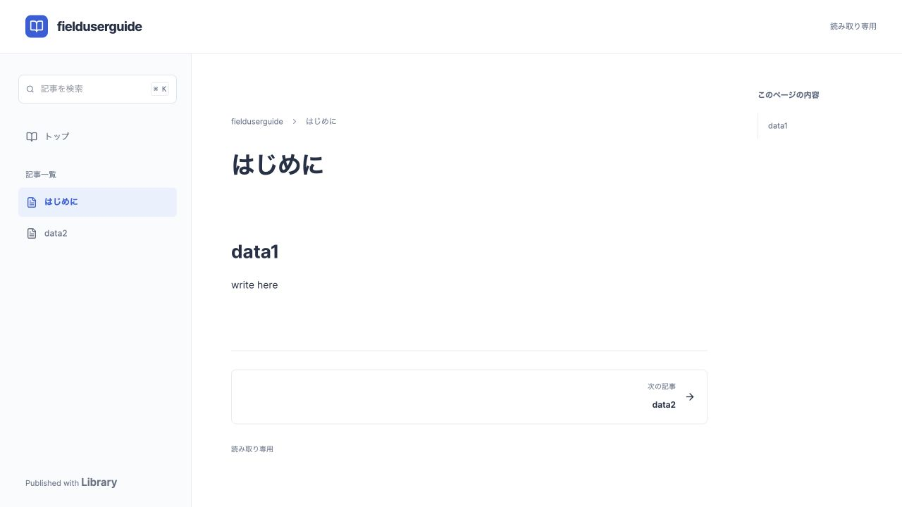

# Public repository documentation reader

Tracking: PLT-4350

The existing `/public/:organization/:repository` route presents a read-only documentation index. `/public/:organization/:repository/:dataId` presents an article with repository navigation, a heading outline, and previous/next links. Existing public URLs keep working.

Repository section tabs expose "Open public docs" (new tab) and "Copy URL" only after an anonymous profile read confirms the repository is public. Clipboard failures are reported without claiming success.

Content comes from the Library API: the repository name and description form the index; Data names form navigation and cards. The existing `getBodyProperty` selection prefers RichText, then legacy Markdown and Html. `RecordBodyEditor` renders that property with `editable={false}`. No properties or copies of Data are created.

All profile, list, and detail requests explicitly use `anonymous: true`. A profile must be public before list or detail reads begin. The repository gate is keyed by organization/repository so navigation cannot reuse another repository's accepted profile. Direct links to unavailable articles display an explicit error state.

Navigation preserves the API's ordering. Search covers loaded article names, with a visible load-more control and scope hint when more pages exist. Pagination appends and deduplicates Data IDs. Previous/next links cover the loaded navigation only. The heading outline observes rendered body headings, including the editor's asynchronous document initialization.

PLT-4350 introduced the public reader UI without SSR, custom domains, article-level publishing, category/order properties, or full-repository search. Public-route response rendering added in PLT-4364 is described below. Public repos remain wholly public. The standalone design prototype lives under `prototypes/public-docs` and is not shipped in the client.

Validation:

- `npm run type-check`
- `npm test -- src/components/public/PublicDocsView.test.tsx src/components/public/PublicDataView.test.tsx src/components/public/PublicRepositoryView.test.tsx src/i18n/catalogs.test.ts`
- `npx eslint src/components/public/PublicDocsView.tsx src/components/public/PublicDocsView.test.tsx src/components/public/PublicShell.tsx`
- `npm run build`
- Local fixture API: anonymous article rendering, generated outline, `contenteditable=false`, 390px navigation and article switching. This is fixture verification, not production content or deployment verification.

## Public-page SEO and theme isolation (PLT-4364)

The public reader pins BlockNote to `light` and scopes both Library and Native
UI color tokens to the document. This prevents an OS-dark BlockNote container
or the signed-in app's dark background from leaving black strips around a
white article. Read-only bodies use their content height instead of the
editor's `55vh` canvas. The user's app theme preference is unchanged.

`npm run build:cloud` also builds a Pages advanced-mode `_worker.js` and
`_routes.json`. Only `/public/*` and `/robots.txt` invoke this worker; other
assets retain normal Pages serving. The worker uses the same build-time
`VITE_LIBRARY_API_BASE_URL` as the client, including `build:preview` overrides.
It needs the default Pages `ASSETS` binding and no API credentials or extra
infrastructure bindings. Deploy the entire `dist` through a Pages Functions
capable deployment path, including `_worker.js` and `_routes.json`.

For each public URL, the worker checks the repository anonymously before
reading the article or listing. The initial HTML includes title, description,
canonical URL, Open Graph/Twitter metadata, JSON-LD (`TechArticle` or
`CollectionPage`), and a visible escaped text fallback with index links. React
then replaces that fallback with the full rich-text/HTML reader. This is
response rendering for the public routes, not SSR of the authenticated app.
Repository HTML and scripts are never inserted into the parent response;
rich-text content and HTML artifacts contribute text only to this fallback.
SPA navigation updates the same metadata and clears server-owned tags when
leaving a public page.

`/public/:organization/:repository/sitemap.xml` is a sitemap index. Its
`?page=N` children list public article URLs in API pages of 100. It is linked
from each page's head and can be submitted to a search engine per repository.
There is no public inventory of all repositories. `robots.txt` permits only
`/public/` on `https://planetlibrary.txcloud.app`; previews are blocked and also
receive `noindex` response headers and metadata. Canonicals omit query strings
and fragments.

Public response data is never cached by this worker (`Cache-Control:
no-store`), so a repository becoming private is checked on the next request.
Missing/private repositories and missing articles return HTTP 404 with
`noindex`; upstream failures return 503 with `Retry-After`. Requests have an
8-second timeout and a 2 MiB JSON response bound. Sitemap indexes are bounded
to 10,000 pages and report an error rather than silently omitting later pages.
These limits affect the initial response; the normal reader retains its own
loading/error UI. Search engines control the timing of indexing/removal.

Validation additions:

- `npm run test:public-docs-worker` exercises the actual workerd HTML rewriter
  through Miniflare: initial HTML, escaping, anonymous-only reads, HTTP error
  semantics, pagination, previews, HEAD, malformed routes, redirects and bounds.
- `npm run type-check:public-docs` checks the response worker separately from
  the browser application. Both commands are included in the existing Worker
  test/type-check scripts used by CI.
- Local UI with the production API (read-only): OS and app dark themes, normal
  desktop width, 390px mobile menu/navigation, and metadata after article
  switching. This does not constitute production deployment verification.

Screenshot: OS dark mode and app `data-theme=dark`, with the public reader
remaining light after the fix:

