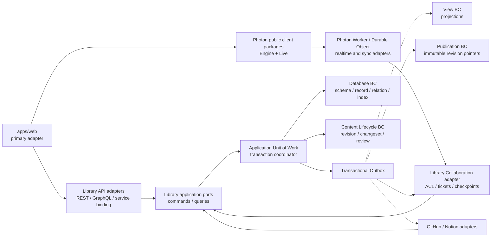

# ADR-0006: Library の Bounded Context と Photon 連携境界

## Status

Accepted (2026-07-15)

## Context

Library は、構造化 CMS、Notion 型の編集体験、GitHub 型の変更管理を一つのナレッジ基盤として提供する。今後は Property Type、Relation、Index、Revision、Review、Publication、外部連携を拡張し、`apps/web` では Photon Engine / Photon Live を使った Linear 型の楽観 UI と共同編集を実現する。

一方、現在の実装には次の境界上の課題がある。

- `Data` / Property の永続化、Relation、Index、外部同期の責務が近接し、Database BC から Integration 実装への逆依存も残っている。
- `Data` には compare-and-swap に使える version がなく、複数 client の更新で lost update を検出できない。
- GitHub、Notion、Yjs、Cloudflare Durable Objects の型をそのまま Database domain へ入れると、provider や realtime runtime が Library の中核モデルを支配する。
- 既存の `GET /ws/collab/:document_key` と `collaborative_documents` は Non-GA / experimental であり、Photon Live と同時に動かすと split-brain になる。
- Page を tree aggregate にすると、table、board、graph など別 View との整合、複数 hierarchy、Relation backlink、移動時の競合処理が Page domain に混入する。

Photon 側では ADR-0001 により、durable mutation / operation log / push-pull を **Photon Engine**、Yjs / WebSocket / presence を **Photon Live** と分け、application server を canonical authority とする方針が採択済みである。Library はこの境界を尊重しつつ、自身の Bounded Context、transaction、authority、移行順序を固定する必要がある。

## Decision

### 1. Bounded Context と所有権

Library は次の Bounded Context に分ける。

| Bounded Context | 所有する概念 | 所有しない概念 |
| --- | --- | --- |
| Database BC | `DatabaseSchema`、`PropertyDefinition`、typed `PropertyValue`、`Record`、`RecordVersion`、`RelationDefinition` / `RelationEdge`、`IndexDefinition` | Yjs room、GitHub branch、Notion page、公開 URL、review workflow |
| Content Lifecycle BC | immutable `Revision`、`ChangeSet`、`Review`、`MergeDecision`、restore、diff | provider 固有 PR、WebSocket session、検索 index の物理表現 |
| View BC | `ViewDefinition`、table / board / tree / graph projection、filter / sort / grouping | canonical Record、parent-child ownership、cascade delete |
| Publication BC | draft / published / archived、preview token、schedule、公開対象 Revision | mutable editor state、provider sync cursor |
| Collaboration BC | Photon document mapping、room ticket、operation decision、checkpoint、presence への adapter | canonical Record / Revision、Database repository、Yjs を使わない domain rule |
| Integration BC | GitHub / Notion の external reference、external revision、cursor、webhook、conflict、ChangeSet mapping | generic Data command、Database の Property metadata、Photon room |
| `apps/web` | editor / renderer、pending / confirmed / rejected / conflict 表示、View 操作 | domain authority、provider secret、server-side permission decision |

`packages/value_object` などの Shared Kernel は ADR-0005 に従い、Tenant / Actor / ID / Revision marker のような最小型だけを共有する。各 BC の aggregate、repository、provider DTO は共有しない。

### 2. Authority

Library における authority は次のように扱う。

| State | Authority |
| --- | --- |
| accepted structured content | Library の immutable `Revision` と、その Revision から得られる current `Record` projection |
| CAS / concurrent update 判定 | Database BC の `RecordVersion` と Content Lifecycle BC の base Revision |
| pending optimistic operation | Photon Engine client の local operation log。Library が accept するまでは canonical ではない |
| realtime editor working state | Photon Live の Yjs document。checkpoint が Library に accept されるまでは collaborative working state |
| presence、cursor、online count | Photon Live。ephemeral であり Library Revision に保存しない |
| published content | Publication BC が指す immutable Library Revision |
| GitHub / Notion 側の変更 | provider の external revision。Library へは Integration BC が ChangeSet として取り込み、直接 Record を上書きしない |

移行期間は既存 Database Record が current state の保存先である。目標状態では、一つの Library command acceptance transaction が current Record の更新、immutable Revision の追加、Relation / Index projection、Outbox event を一貫して確定する。Revision は履歴と参照の canonical identity、Record は current query projection とする。

Photon Engine の `accepted` は Library の decision を受けたことを意味する。Photon Live の Yjs state、Durable Object storage、client IndexedDB / PGlite のどれも、単独では Library の canonical truth にならない。

### 3. 依存方向

依存方向は outer adapter から application port、application port から domain の内向きに限定する。

具体的には次を禁止する。

- Database BC から `apps/api/packages/inbound_sync`、`outbound_sync`、Photon、GitHub、Notion への依存。
- Collaboration / Integration adapter から Database repository への直接アクセス。
- generic `AddData` / `UpdateData` command から provider writeback を起動すること。
- Database Property の `meta_json` を provider 接続設定や sync cursor の正本にすること。
- Photon の operation、decision、Yjs update 型を Database domain の public type にすること。
- `apps/web` から server repository、Durable Object binding、provider secret を直接扱うこと。

Database / Content Lifecycle は accepted command と domain event の contract を公開する。domain は event を返すだけで Outbox repository に依存せず、application Unit of Work が domain state と Outbox event を同じ transaction に永続化する。View、Publication、Collaboration、Integration は application port または Outbox event を通して連携し、core BC の内部 module を import しない。

### 4. Page は flat Record のまま保持する

Page 専用 tree aggregate、`parent_id`、`children` collection は導入しない。

Hierarchy は Database BC の Property と View BC の定義を使って投影する。

- parent は同一 Database を対象にできる single self Relation Property とする。
- sibling order は versioned Property Type Kernel が提供する `Rank` / `Position` Property とする。
- `TreeViewDefinition` は少なくとも `parent_relation_property_id`、`rank_property_id`、root / orphan の表示規則を持つ。
- node 移動は Relation value と Rank value の CAS update に変換する。
- cycle、missing parent、multi-parent、同一 Rank は View projector が決定論的に検出・表示する。
- delete ownership や cascade は Page tree から暗黙に導出せず、RelationDefinition の `on_delete` policy に従う。
- reverse lookup / backlink は Relation index から取得し、Page に children list を重複保存しない。

この構成により、一つの Record を複数の tree、table、board、graph で表示できる。

### 5. Property Type の拡張戦略

Property Type の定義は #131 の versioned kernel に集約する。runtime から任意 code を読み込む plugin model ではなく、Library build に含まれる built-in handler を composition root で登録する。

PropertyDefinition は表示名とは別に次の stable contract を持つ。

- `type_key`: rename しない安定 key。例: `boolean`、`decimal`、`datetime`、`relation`、`rank`。
- `type_version`: config / value semantics の互換境界を表す単調増加 version。
- `config`: handler が検証する versioned configuration。Relation target、Decimal precision、Select options などを保持する。
- `value_encoding_version`: normalized PropertyValue の wire / storage encoding version。
- `capabilities`: equality / range / full-text / sort / unique / reference extraction / multi-value など、query と index が利用できる能力。

各 handler は `validate_config`、`validate_value`、`encode`、`decode`、`compare`、`index_capabilities`、`extract_references`、`conversion_policy` を実装する。adapter ごとの `_ => String` fallback は禁止し、REST、GraphQL、Rust public API、SDK、`apps/web` editor / renderer は同じ type key / version matrix を exhaustive に扱う。

未知の `type_key` / `type_version` を読み取った場合、raw value envelope と config を破壊せず保持する。server は mutation と index build を拒否し、`apps/web` は type key / version と raw value を read-only 表示する。既知の String へ黙って変換して保存し直してはならない。

type upgrade は次の順で行う。

1. 新旧 version の reader と conversion plan を先に配布する。
2. dry-run で invalid / lossy / ambiguous value と必要 index rebuild を列挙する。
3. tenant / Database 単位で idempotent backfill し、旧 value と変換後 value の parity を検証する。
4. writer を新 version へ切り替え、rollback window 中は旧 reader を維持する。
5. rollback window と旧 binary の稼働終了を確認してから旧 encoding を削除する。

追加順は、Boolean、Decimal、DateTime、Rank / Position、URL / Email、Status、Person、Asset / File、RichText / DocumentRef、Formula / Rollup とする。Formula / Rollup は Relation と Index が完成した後に実装する。各 type は domain validation、storage round-trip、REST / GraphQL、SDK、`apps/web` editor / renderer、filter / sort / index、upgrade / rollback を一つの contract test matrix で完了させる。

### 6. Transaction、CAS、Outbox

Library 内部では次を一つの command acceptance transaction とする。

1. tenant、actor、permission、schema、Property value、Relation target を検証する。
2. `operation_id` の一意性を確認し、retry を idempotent にする。
3. `expected_record_version` と base Revision を現在値と比較する。
4. Record、PropertyValue、RelationEdge、Index projection を更新する。
5. immutable Revision と audit metadata を追加する。
6. domain event を Outbox に追加する。
7. commit 後に `accepted`、`rejected`、`conflict` と canonical version を返す。

4 から 6 は application Unit of Work が同じ persistence transaction で確定する。Database / Content Lifecycle domain は Outbox adapter を呼ばない。

transaction 内で同期更新する index は、domain invariant と primary query に必要な typed property exact / range / unique projection、RelationEdge reverse lookup とする。外部 full-text search、vector search、analytics index は Outbox consumer が非同期更新する rebuildable projection とし、command validation や uniqueness の正本にしない。外部 index API を Library transaction 内から呼ばない。

Library と Photon、GitHub、Notion の間に distributed transaction は作らない。外部 delivery は at-least-once とし、`operation_id` / event id / external revision を使って冪等化する。

Photon Engine client でも local operation、optimistic projection、outbox enqueue を一つの local transaction にする。push が成功しただけでは local operation を accepted にせず、Library の decision を保存してから状態を遷移する。pull cursor は全 decision と他 actor の accepted operation を再現できなければならない。

### 7. Database storage の安全な移行

#132、#130、#133 では、既存の `value0..value50`、Relation CSV、legacy `indexes` metadata を一度に置き換えない。次の expand / migrate / contract 手順を使う。

1. normalized PropertyValue、RelationEdge、typed Index projection を additive migration で追加する。
2. normalized-first / legacy-fallback の dual-read と、feature flag 下の dual-write を導入する。
3. tenant / Database 単位の checkpoint を持つ idempotent backfill を実行する。不正 Relation CSV は panic せず quarantine と監査対象にする。
4. row count、Property type / value hash、Relation source / target、tenant scope、unique constraint、代表 query の `EXPLAIN` を比較する。
5. parity gate を通過した tenant から normalized read、normalized write の順に cutover する。
6. rollback window 中は legacy read と dual-write を維持し、feature flag で直前の reader に戻せるようにする。
7. 全 tenant の parity、backup / restore、旧 binary の停止、rollback SLA 経過を確認してから legacy column / CSV / metadata を削除する。

RelationDefinition の既定 `on_delete` は `Restrict` とする。parent 表示などで `Nullify` が必要な Relation だけ明示設定し、暗黙 cascade は導入しない。

### 8. Photon Engine / Photon Live との接続

`apps/web` は Photon repo の UI、router、domain model を取り込まず、公開された client package と Library 専用 adapter だけを利用する。

Structured operation の基本 flow は次とする。

1. `apps/web` が Library API から canonical Revision、RecordVersion、許可 scope を bootstrap する。
2. Photon Engine client が local operation、projection、outbox を atomically 保存し、UI を `pending` として即時更新する。
3. Engine push は `operation_id`、actor / device、`tenant_id` / `database_id` / `data_id` / `property_id` scope、base Revision、expected RecordVersion を送る。
4. Photon server / Worker は認証と transport validation を行い、Library Collaboration adapter の application port へ変換する。
5. Library が domain validation と transaction を実行し、`accepted` / `rejected` / `conflict` を返す。
6. Photon Engine が decision と pull cursor を保存し、`apps/web` が confirm、rollback、または rebase UI を表示する。

Rich text / document collaboration の基本 flow は次とする。

1. `apps/web` が Library API から短命の signed room ticket を取得する。
2. Photon Live が ticket に含まれる server-issued document scope の Durable Object へ接続する。
3. Yjs update / awareness / presence を room 内で broadcast する。
4. checkpoint 時に `operation_id`、base Revision、state vector / content hash、snapshot または compacted update を Library Collaboration port へ送る。
5. Library が新しい immutable Revision を accept した後、その Revision を room と client の canonical checkpoint とする。

Collaboration adapter は Photon contract と Library command の anti-corruption layer である。Photon server / Durable Object は Library DB に直接接続せず、Library API または private service binding を通す。

Photon の authorization key は Library の canonical ID とする。Library の Repo は Database への application-level mapping / navigation shell であり、`repo_username` を authorization key や Durable Object identity にしない。ticket に `repo_id` を routing metadata として含める場合も、Library が `repo_id -> tenant_id / database_id` の所有関係を検証し、canonical scope を併記する。

### 9. Cloudflare Durable Object の room、認証、永続化

Photon Live は一つの collaborative document を一つの coordination atom として Durable Object に割り当てる。通常は一つの Data 本文が一 document だが、複数 document Property を持つ場合は Property ごとに server-issued `document_id` を発行する。

- room key は `tenant_id` / `database_id` / `data_id` / `property_id` / `document_id` scope から server 側で決定論的に導出する。client が任意の `room` query を指定して Durable Object 名を作ることを禁止する。
- ticket は少なくとも canonical scope、actor、許可 action、expiry、nonce / session id を含み、Library が署名する。
- Worker と Durable Object は WebSocket upgrade 前に signature、expiry、scope、origin を検証する。domain edit permission の最終判断は Library が行う。
- production CORS / Origin は allowlist とし、wildcard と user Authorization の無検証転送を許可しない。
- Cloudflare WebSocket Hibernation API を使い、idle connection 中は Durable Object を hibernate できる構成にする。再起動後に必要な connection metadata は WebSocket attachment から復元し、in-memory global state だけに依存しない。
- Durable Object storage は bounded な Yjs snapshot / update log、dedup state、checkpoint cursor に限定する。update log は threshold で compact し、無限 replay を許可しない。
- Library の Record、Revision、permission、cross-document query、search index は Durable Object storage に複製して authority にしない。
- oversized / malformed update、ticket replay、reconnect、hibernation 復帰、snapshot corruption、複数 client convergence を Workers Vitest integration で検証する。

同一 Cloudflare deployment boundary では Service Binding を優先し、Photon Worker から Library edge adapter への public Internet round-trip と公開 credential を減らす。別 account / region になる場合は、明示的な service authentication と request signing を持つ private adapter を用意する。

### 10. `apps/web` のみを primary client とする

> **Superseded in part by [ADR-0007](ADR-0007-primary-client-apps-client.md) (2026-08-30)**
> この section は無効である。primary client は `apps/client` (library v2) であり、`apps/web` (v1) は縮退中で新規の Photon / Property surface を持たない。
> supersede されるのは §10 のみで、本 ADR の他 section は引き続き有効。

この移行で変更する client は `apps/web` のみとする。`apps/client` は Photon integration、Property editor registry、optimistic state machine、tree projection の実装対象にしない。

`apps/web` は次の adapter を持つ。

- Property type key / version から editor と renderer を選ぶ registry。
- Photon operation を Library command DTO へ変換する adapter。
- `pending`、`confirmed`、`rejected`、`conflict` の一貫した UI state。
- Relation / Rank update へ変換する tree interaction。
- offline outbox、retry、reconnect、rollback / rebase の表示。

server contract は client 固有 state に依存せず、将来別 client を追加する場合も同じ public application port を使う。

### 11. 既存 Collaboration WebSocket の移行

既存の `GET /ws/collab/:document_key` と `collaborative_documents` は Photon Live へ段階的に置き換える。

1. 現在の route は引き続き Non-GA / default disabled とする。
2. #134 と Photon #40-43 を満たすまで production traffic を Photon へ切り替えない。
3. document mapping と latest Library Revision checkpoint を作成する。
4. tenant / document 単位の routing flag で canary を行い、一つの document は旧 WebSocket と Photon Live のどちらか一方だけを使う。
5. Library Revision を基準に Photon room を hydrate し、接続・checkpoint・reconnect・conflict を検証する。
6. rollback window 後に旧 route、persistence adapter、`collaborative_documents` migration を削除する。

同一 document への dual-write は行わない。rollback は新規 Photon session を止め、最後に accepted された Library Revision から再開する。Durable Object の未確定 working state を旧 WebSocket DB へコピーして正本化しない。

## Consequences

### Positive

- Library の schema、Relation、Index、Revision が Photon / GitHub / Notion の実装詳細から独立する。
- Page を flat Record のまま維持し、Property から複数 hierarchy を投影できる。
- Linear 型の楽観 UI と canonical server validation を両立できる。
- Durable Object を document-local coordination に絞り、tenant 横断 query、監査、公開、検索を Library に残せる。
- CAS、idempotency、Outbox が Photon、View、Publication、Integration の共通基盤になる。
- `apps/client` への二重実装を避け、`apps/web` の product surface に集中できる。

### Negative

- optimistic projection と canonical state の二層を実装・テストする必要がある。
- Record / Revision / Relation / Index / Outbox を一貫して更新する Unit of Work が必要になる。
- Yjs checkpoint、snapshot compaction、ticket rotation、reconnect の運用コストが増える。
- Property Type、Relation、Index、Revision の基盤が揃うまで、Tree View、Rollup、Photon integration を完成できない。
- Photon と Library の contract versioning、互換性 test、障害切り分けが必要になる。

### Neutral

- Yjs は Photon Live の collaboration model として継続利用する。
- Durable Objects、PGlite、IndexedDB は responsiveness / coordination のために利用するが、Library の canonical domain store にはしない。
- 初期実装では Library の current Record と Revision を同一物理 DB transaction に置いてよい。物理 store を分離する場合は transaction / saga 方針を別 ADR で再決定する。
- GitHub / Notion は外部ではそれぞれの truth を持つが、Library Record への反映は必ず ChangeSet / Revision acceptance を通る。

## Alternatives Considered

### Page を tree aggregate にする

parent / children の操作は直感的になるが、複数 hierarchy、table / board / graph、Relation backlink と重複し、cascade ownership が Page に固定されるため不採用。Relation Property + Rank Property の View projection とする。

### Durable Object / Yjs を Library の canonical store にする

room 内の共同編集は単純になるが、cross-document query、typed Property validation、Relation、Index、audit、Revision、Publication、migration を opaque update log の上に再構築する必要があるため不採用。

### Library の既存 WebSocket と Photon Live を dual-write する

移行中の見かけ上の可用性は上がるが、二つの Yjs log と checkpoint が競合し、どちらを復旧元にするか決められないため不採用。document 単位の single routing とする。

### Photon domain type を Database BC に取り込む

adapter は減るが、Photon の operation / Yjs / deployment 変更が Database invariant と migration に波及するため不採用。Collaboration BC に anti-corruption layer を置く。

### generic Data update から外部 provider へ自動 writeback する

操作は少なくなるが、branch、permission、expected external revision、failure semantics が暗黙になり、Data update 成功後の provider failure も隠れるため不採用。Integration command / ChangeSet に限定する。

### `apps/web` と `apps/client` を同時に対応する

surface parity は早く見えるが、異なる client state / router / editor を同時に移行すると contract の確定が遅れるため不採用。primary client を `apps/web` に限定する。

## Follow-up

実装は次の依存順で進める。

1. #139 で Database BC から Integration 実装依存を排除する。
2. #132 で PropertyValue storage を正規化する。
3. #131、#130、#133 で versioned Property Type Kernel、RelationDefinition / RelationEdge、declarative Index / QuerySpec を実装する。
4. #134 で RecordVersion、CAS、idempotency、transactional Outbox を実装する。
5. Photon #40、#41、#42、#43 で Engine push / pull、transactional local outbox、signed room、public client package を完成する。
6. #137 で Revision、ChangeSet、Review、Publication lifecycle を実装する。
7. #138 で Photon Engine / Live を `apps/web` に統合し、旧 Collaboration WebSocket を移行する。
8. #135 で Relation / Rank による Tree View を `apps/web` に実装する。
9. #136 で GitHub / Notion を ChangeSet adapter として統合する。

各段階は domain / contract / migration / `apps/web` / Worker integration test を同じ縦切りで完了させる。後続 issue は #124 の roadmap で追跡する。

## References

- [Library roadmap issue #124](https://github.com/quantum-box/library/issues/124)
- [Architecture issue #125](https://github.com/quantum-box/library/issues/125)
- [Photon ADR-0001: Sync Responsibility Boundaries](https://github.com/quantum-box/photon/blob/main/docs/architecture/decisions/ADR-0001-sync-responsibility-boundaries.md)
- [Photon Engine prerequisite #40](https://github.com/quantum-box/photon/issues/40)
- [Photon web sync prerequisite #41](https://github.com/quantum-box/photon/issues/41)
- [Photon Live room prerequisite #42](https://github.com/quantum-box/photon/issues/42)
- [Photon public package prerequisite #43](https://github.com/quantum-box/photon/issues/43)
- [Cloudflare Durable Objects: WebSocket Hibernation](https://developers.cloudflare.com/durable-objects/best-practices/websockets/)
- [Cloudflare Durable Objects: Rules of Durable Objects](https://developers.cloudflare.com/durable-objects/best-practices/rules-of-durable-objects/)
- [Cloudflare Durable Objects: SQLite-backed storage API](https://developers.cloudflare.com/durable-objects/api/sqlite-storage-api/)
- [Cloudflare Workers: Service Bindings](https://developers.cloudflare.com/workers/runtime-apis/bindings/service-bindings/)
- [Cloudflare Durable Objects testing](https://developers.cloudflare.com/durable-objects/examples/testing-with-durable-objects/)
- [Current Collaboration WebSocket scope](../integrations/collaboration-ws.md)
- [Current Collaboration handler](../../../apps/api/src/collaboration/handler.rs)
- [Current Collaboration persistence](../../../apps/api/src/collaboration/persistence.rs)
- [Current Collaboration migration](../../../apps/api/migrations/20260301000000_add_collaborative_documents.up.sql)
