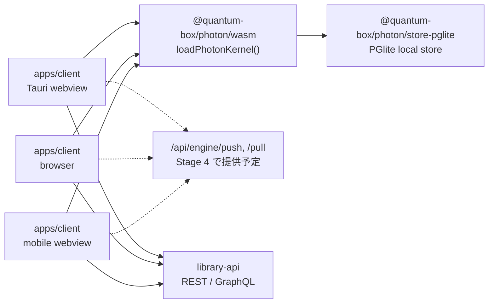

# ADR-0007: primary client を `apps/client` とし、Photon を published package から使う

## Status

Accepted (2026-08-30)

この ADR は [ADR-0006](ADR-0006-library-photon-bounded-contexts.md) の **§10「`apps/web` のみを primary client とする」のみ** を supersede する。ADR-0006 の他の section は引き続き有効である。詳細は「4. ADR-0006 のうち有効な範囲」を参照。

## Context

ADR-0006 は 2026-07-15 に Accepted となり、§10 で「この移行で変更する client は `apps/web` のみとする」「`apps/client` は Photon integration、Property editor registry、optimistic state machine、tree projection の実装対象にしない」と決めた。

実態はその逆であり、しばらく前からそうなっている。

- `apps/web` に Photon 由来の実装は一つも無い。`grep -ril photon apps/web` の hit は 0 件である。
- Photon が実際に載っているのは `apps/client` であり、Property editor registry、optimistic state machine、local store、sync dashboard もそこにある。repo root の `CLAUDE.md` は **library v2 = `apps/client`（Tauri + React、コード内の別名は "Photon"）**、**library v1 = `apps/web`** と呼称を定義している。
- 2026-08 に実施した de-vendoring 移行（#263、#265、#277、#279、#271）は、すべて `apps/client` を対象としている。
- 公開 URL は v2 から配信する方針に変わり、`apps/web` は縮退中である。

つまり §10 の理由付け（「surface parity は早く見えるが、異なる client state / router / editor を同時に移行すると contract の確定が遅れる」）は、実行されなかった選択を擁護している。今 ADR-0006 を読んだ者は、Photon の実装対象を誤って `apps/web` と理解する。ADR は記録であって書き換えないため、§10 を supersede する新しい ADR を置く。

## Decision

### 1. primary client は `apps/client` とする

Photon integration、Property editor registry、optimistic state machine、tree projection の実装対象は `apps/client` である。`apps/web` は wind-down 対象とし、新規の Photon surface / Property surface を追加しない。

| App | 呼称 | 位置づけ | Photon / Property surface |
| --- | --- | --- | --- |
| `apps/client` | library v2 | primary client。Tauri desktop / web / mobile の共通 shell。公開 URL の配信元 | 実装対象。Engine、local store、editor registry、optimistic state、tree projection すべてここ |
| `apps/web` | library v1 | wind-down。既存機能の維持と bug fix のみ | 新規追加しない。既存の Photon 実装も無い |
| `apps/api` | library-api | v1 / v2 共通 backend。canonical authority | ADR-0006 §2 の authority model のまま |

ADR-0006 §10 後段の「server contract は client 固有 state に依存せず、将来別 client を追加する場合も同じ public application port を使う」は、primary client が入れ替わっても成立する制約であり、そのまま維持する。

### 2. 実施済みの移行（記録）

`apps/client/packages/photon-engine/` に置いていた Photon の vendored copy を、published package `@quantum-box/photon` (`^0.3.0`) に置き換え、その後 vendored tree を削除した。

| Stage | PR | 内容 | diff |
| --- | --- | --- | --- |
| Stage 1 | #263 | vendored copy が抱えていた stale な Photon docs を削除 | +51 / -1,718 |
| Stage 2 | #265 | 自前 copy ではなく Photon 本体の edge worker を使う | +41 / -495 |
| Stage 3 | #277 | local store を published package の実装へ差し替え（re-land） | +855 / -1,894 |
| Stage 3b | #279 | records collection に Photon の `RestResource` を与える | +362 / -6 |
| Stage 4 | — | `photon_axum::engine_router()` を `apps/api` に mount | **未実施**（§6 参照） |
| Stage 5 | #271 | `apps/client/packages/photon-engine/` を削除 | +9 / -17,469 |

Stage 1 / 2 / 3 / 5 の削除は合計 21,576 行である。Stage 5 単独で 49 ファイル / 17,469 行を削除し、その中に vendored の `photon_engine_bg.wasm`（322,651 bytes）が含まれる。

削除に伴い、次の build 依存も無くなった。

- `wasm-pack` による WASM ビルド（`apps/client/scripts/build-photon-wasm.mjs`、`npm run engine:wasm`、`mise.toml` の tool pin、対応する CI job）。WASM は published package に同梱されたものを読む。
- vendored copy 専用の `apps/client/.github/workflows/ci.yml` / `server-deploy.yml`、`docker-compose.local-sync.yml`、および root `Cargo.toml` の workspace member 登録。

`apps/client/src/lib/photonEngine/client.ts` は、以前 1,552 行の再実装だったものが、collection 定義・データの置き場・request の認可という「このアプリ固有の配線」だけになっている。

### 3. Tauri も WASM kernel を webview で動かす

desktop shell も web / mobile と同じく、WASM kernel を webview 内で読み込む。

upstream の Photon には Tauri invoke route が存在しない。したがって `photon_engine_apply_operation` command と、そのために `apps/client/src-tauri` が持っていた Rust 依存は削除した。現在 `src-tauri` の `invoke_handler` に残るのは `app_target_os` と macOS の tab / menu command だけであり、`Cargo.toml` に Photon 依存は無い。

shell ごとに kernel の実行場所を分岐させない。desktop だけ Rust native kernel を持つ構成は、operation semantics の二重実装と shell 間の差分テストを生むため採らない。

### 4. ADR-0006 のうち有効な範囲

supersede するのは §10 だけである。以下は影響を受けない。

| ADR-0006 の section | 状態 |
| --- | --- |
| §1 Bounded Context と所有権 | 有効。表中の `apps/web` 行は primary client として `apps/client` に読み替える。所有 / 非所有の内容自体は変わらない |
| §2 Authority | 有効 |
| §3 依存方向 | 有効。図中の `apps/web` は `apps/client` に読み替える。禁止事項はそのまま |
| §4 Page は flat Record のまま保持する | 有効 |
| §5 Property Type の拡張戦略 | 有効 |
| §6 Transaction、CAS、Outbox | 有効 |
| §7 Database storage の安全な移行 | 有効 |
| §8 Photon Engine / Photon Live との接続 | 有効（§5 も参照） |
| §9 Cloudflare Durable Object の room、認証、永続化 | 有効 |
| §10 `apps/web` のみを primary client とする | **この ADR が supersede する** |
| §11 既存 Collaboration WebSocket の移行 | 有効 |

ADR-0006 全体が無効になったわけではない。§10 以外を「古い決定」として扱ってはならない。

### 5. §8 の canonical-id rule は load-bearing であり、引き続き binding

ADR-0006 §8 の次の規定は、primary client が入れ替わっても効力を持つ。

> Photon の authorization key は Library の canonical ID とする。Library の Repo は Database への application-level mapping / navigation shell であり、`repo_username` を authorization key や Durable Object identity にしない。

`repo_username` は tenant 内で rename 可能な表示上の名前であり、authorization key にすると rename が権限境界を動かす。Durable Object identity にすると rename で room が割れる。

Stage 3b の collection key はこの規定に従う。collection は `data:{database_id}` の形で canonical ID から導出し、`{org}/{repo}` を key にしない。ticket に `repo_id` を routing metadata として載せる場合も、Library が `repo_id -> tenant_id / database_id` の所有関係を検証し canonical scope を併記する、という §8 の手順を維持する。

### 6. 未決 / 未完（overclaim しないための記録）

この ADR の時点で、次は決まっていない、あるいは終わっていない。

**Stage 4 は未実施である。** `photon_axum::engine_router()` を `apps/api` に mount して production Engine を立てる作業は行われていない。photon repo が private であることが blocker で、`apps/api` から Rust dependency として引くには repo の public 化か CI credentials が要る。それまでの間:

- client の `/api/engine/push` / `/api/engine/pull` 呼び出しは 404 する。
- docs metadata は browser 内にしか存在しない。`legacyMigration.ts` の `CARRIED_COLLECTIONS` が `documents` / `attachments` だけを carry-over 対象にしているのは、この 2 つに server 側の置き場が無いためである（`records` は Library API から取り直せる）。

**Stage 3b は半分しか終わっていない。** records collection には Photon の `RestResource`（`apps/client/src/lib/recordsApi.ts` の `LibraryRecordsResource`）があり、`create` / `upsert` / `update` / `remove` と server-assigned id の alias 登録まで通っている。一方で、collection は全 repository で一つを共有したままである（`activeRecordsCollection()` は `library_data_records` という単一の定数を返す）。書き込みごとに宛先 repository を引き直す lookup も残っている。§5 の `data:{database_id}` 分割は、この残作業で行う。

これらが片付くまで、production Engine が存在する前提の設計判断（Engine 経由の docs 同期、cross-device の operation log、server 側 decision に依存する UI 状態）を確定してはならない。

## Consequences

### Positive

- ADR を読んだ者が、Photon の実装対象を `apps/client` と正しく理解できる。
- vendored copy との drift、二重の CI、`wasm-pack` の tool pin が消え、Photon 側の修正が package 更新だけで届く。
- desktop / web / mobile が同じ kernel 経路を通るため、shell 固有の operation semantics 差分が生まれない。
- ADR-0006 の core（BC、authority、依存方向、Property Type kernel、transaction / CAS / Outbox、Durable Object rule）を捨てずに、client の記述だけを訂正できる。

### Negative

- ADR-0006 §1 / §3 の表・図に残る `apps/web` の記述を、読み手が §4 の対応表で読み替える必要がある。ADR 本体は書き換えない。
- Photon の破壊的変更が published package の version 更新として降ってくる。vendored copy のように手元で pin して凌ぐことができない。
- Stage 4 が blocker 待ちのため、`/api/engine/*` を前提とした機能は着手できない。
- `apps/web` に残る利用者向け機能は、v2 へ寄せるまで v1 側で維持コストを払い続ける。

### Neutral

- `apps/web` を即座に削除はしない。縮退の完了時期はこの ADR では決めない。
- `@quantum-box/photon` の version pin 方針（`^0.3.0` を維持するか厳密 pin にするか）はこの ADR では固定しない。
- photon repo を public 化するか CI credentials を配るかの判断は Photon 側に属し、この ADR では決めない。
- desktop の identifier / storage namespace / WiX upgradeCode は既存のまま凍結する。この ADR は変更しない。

## Alternatives Considered

### ADR-0006 §10 の通り `apps/web` を primary client にし直す

ADR との整合は取れるが、Photon integration、editor registry、optimistic state machine を `apps/client` から `apps/web` へ移し替える作業が発生する。公開 URL の配信元も v2 に移っており、縮退中の v1 へ product surface を戻す理由が無いため不採用。

### ADR-0006 全体を supersede する

`apps/web` の記述が古い section を個別に判定させずに済むが、BC の切り方、authority model、依存方向、Property Type kernel、transaction / CAS / Outbox、Durable Object rule は現在の実装がそのまま従っている。全体を無効にすると、これらの根拠が宙に浮くため不採用。§10 のみを supersede し、対応表で有効範囲を明示する。

### vendored copy を残し、published package と併存させる

Photon 側の未リリース変更を先取りできるが、同じ engine の実装が二つになり、どちらが動いているかが実行時まで分からない。`wasm-pack` の tool pin と専用 CI も維持し続けることになるため不採用。

### Tauri 向けに invoke route を自前で足す

desktop で native kernel を使えば PGlite / WASM の起動コストは下げられるが、upstream に route が無いため Library 側で operation semantics を再実装することになる。ADR-0006 §3 の「Photon の operation、decision、Yjs update 型を Database domain の public type にしない」に照らしても、Library 側が Photon の内部 protocol を持つのは避けたい。shell 間の差分テストも増えるため不採用。

### `repo_username` を collection key / room key に使う

repo 名がそのまま key になり実装は短くなるが、rename が権限境界と Durable Object identity を動かす。ADR-0006 §8 が明示的に禁止しており、この ADR でも維持する。

## Follow-up

- photon repo の public 化（または `apps/api` の CI credentials 整備）を Photon 側と決着させ、Stage 4 で `photon_axum::engine_router()` を mount する。
- Stage 3b の残り: collection key を `data:{database_id}` に分割し、書き込みごとの宛先 repository lookup を外す。
- Stage 4 完了後、`documents` / `attachments` の server 側の置き場を決め、`CARRIED_COLLECTIONS` の carry-over を終了させる。
- `apps/web` の縮退計画（残存機能の棚卸しと停止時期）を別途決める。
- `docs/specs/index.md` の ADR 一覧に ADR-0006 / ADR-0007 を追加する。

## References

- [ADR-0006: Library の Bounded Context と Photon 連携境界](ADR-0006-library-photon-bounded-contexts.md)（§10 をこの ADR が supersede する）
- [Photon 脱ベンダー化の移行記録](https://claude.ai/code/artifact/0ab7cae3-891f-48a2-9a7f-8f0a6094f100)
- [Photon ADR-0001: Sync Responsibility Boundaries](https://github.com/quantum-box/photon/blob/main/docs/architecture/decisions/ADR-0001-sync-responsibility-boundaries.md)
- Stage 1: [#263 stop carrying a stale copy of Photon's docs](https://github.com/quantum-box/library/pull/263)
- Stage 2: [#265 use Photon's own edge worker instead of a copy of it](https://github.com/quantum-box/library/pull/265)
- Stage 3: [#277 Re-land the Photon local store](https://github.com/quantum-box/library/pull/277)
- Stage 3b: [#279 Give the records collection a Photon REST resource](https://github.com/quantum-box/library/pull/279)
- Stage 5: [#271 delete the vendored copy of Photon](https://github.com/quantum-box/library/pull/271)
- [呼称の定義](../../../CLAUDE.md)
- [Photon local store の配線](../../../apps/client/src/lib/photonEngine/client.ts)
- [legacy engine データの carry-over](../../../apps/client/src/lib/photonEngine/legacyMigration.ts)
- [records collection の RestResource](../../../apps/client/src/lib/recordsApi.ts)
- [Tauri invoke handler](../../../apps/client/src-tauri/src/lib.rs)
