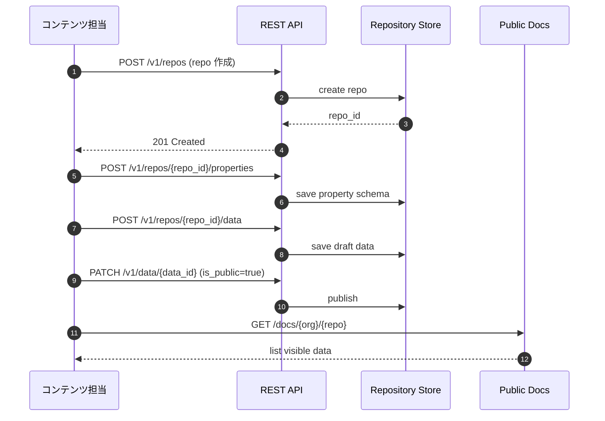
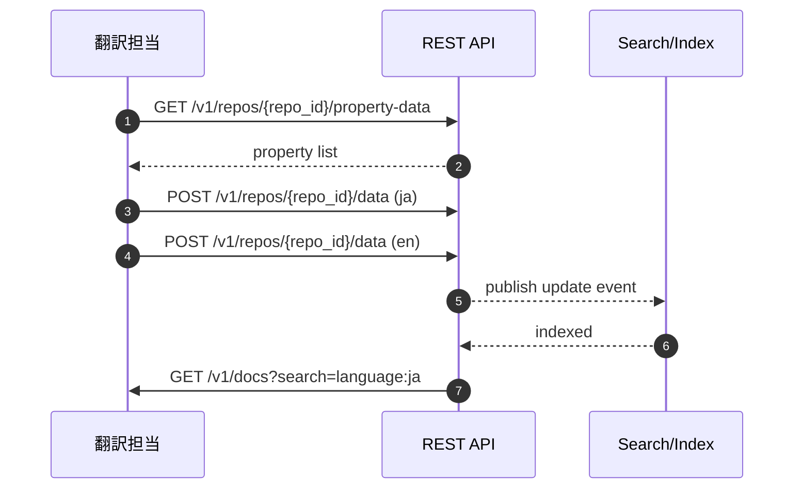
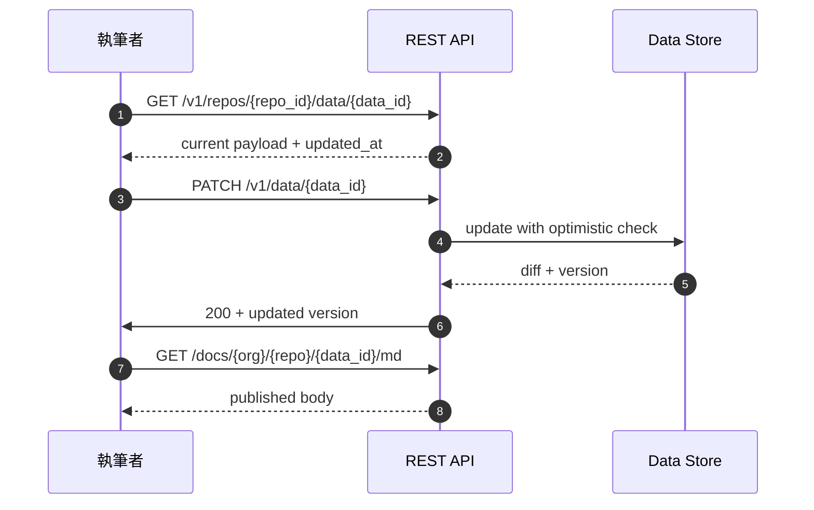
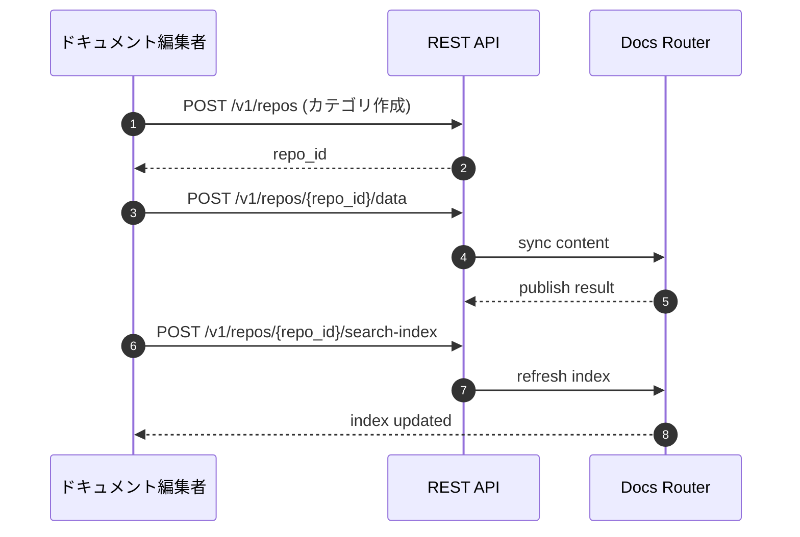
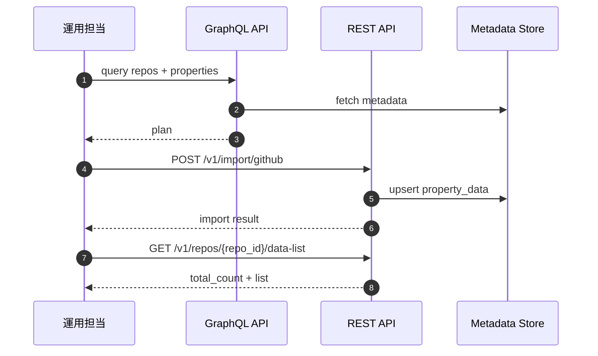
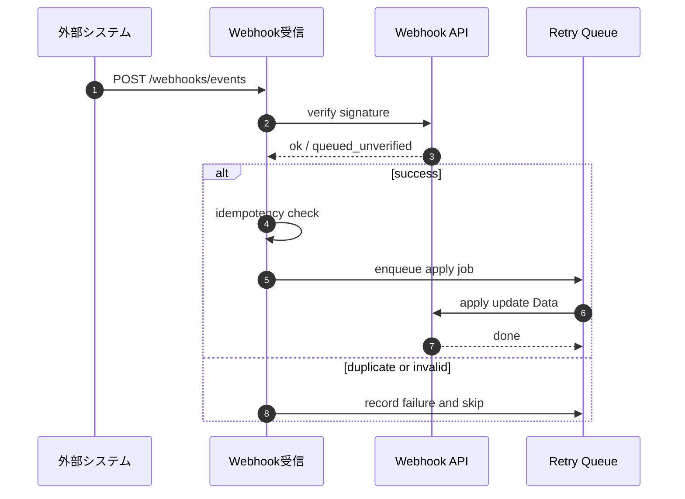
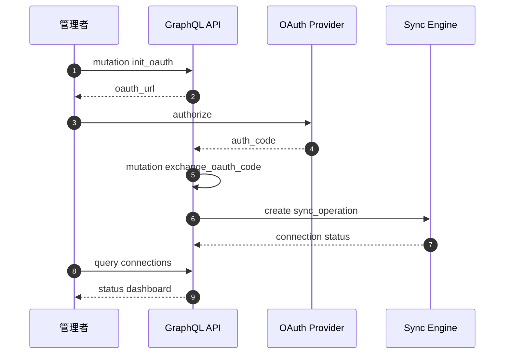
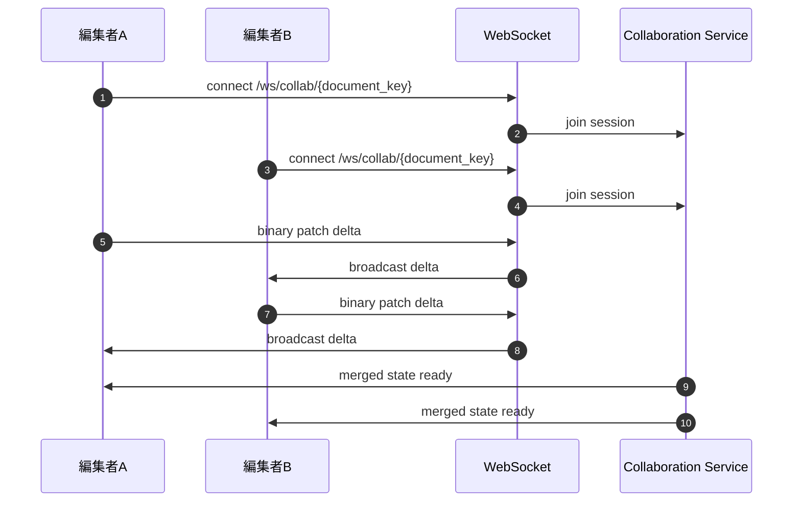

# 利用ユースケース シーケンス図（簡易）

この資料は [use-cases.md](/Users/takanorifukuyama/git/github.com/quantum-box/library/docs/specs/use-cases/use-cases.md) の UC-01〜UC-08 に対応します。

## UC-01 記事台帳構築（REST）

## UC-02 多言語記事管理（REST）

## UC-03 更新履歴運用（REST）

## UC-04 API仕様ナレッジ化（REST + Docs）

## UC-05 エディタ横断統合（REST + GraphQL）

## UC-06 外部イベント自動更新（Webhook）

## UC-07 接続管理一元化（GraphQL）

## UC-08 同時編集（WebSocket）

